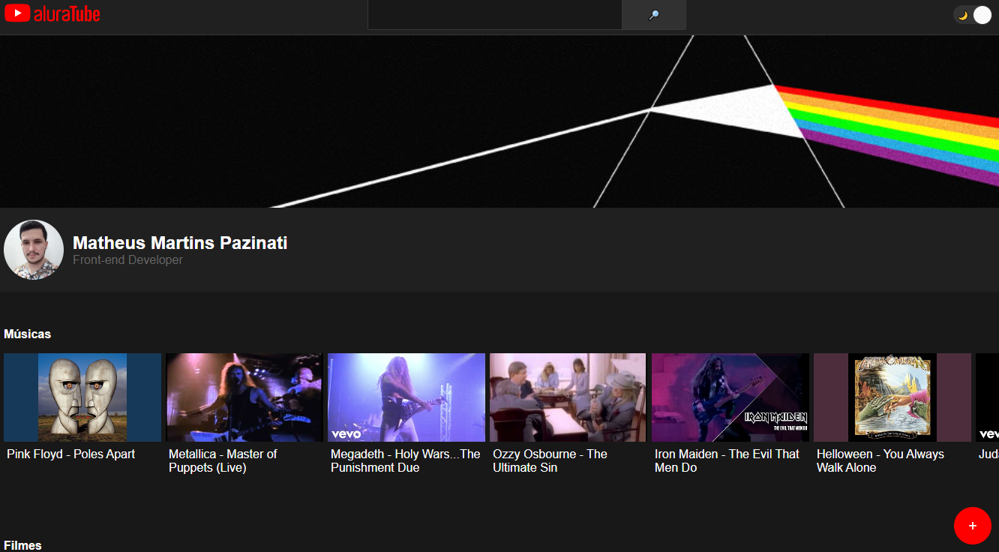

<h1 align="center">
    📹 AluraTube
</h1>

  

<h2>📺 Sobre</h2>

Projeto criado durante a Imersão React da Alura. O projeto é um site que permite o usuário adicionar um vídeo do Youtube (através da URL) e colocá-lo em uma categoria (Músicas, Filmes ou Tecnologia), salvando esses dados em um Back-end-as-a-service (Supabase), tendo assim um controle sobre quais vídeos ele precisa assistir, ou simplesmente para que outras pessoas possam visualizar quais vídeos ele mais gosta, por exemplo.

 
<h2>🎯 Objetivo</h2>

Meu objetivo ao desenvolver este projeto foi aplicar na prática 3 conceitos: Criação e utilização de Contextos no React, para conseguir compartilhar informações entre componentes de uma forma mais direta, Criação de Hooks, para extrair a lógica de um componente em funções reutilizáveis (Como um formulário, por exemplo) e Criação de Services, para centralizar métodos e valores que dizem respeito a utilização de um serviço de terceiro (uma API, por exemplo). Além disso, as aulas foram ministradas utilizando Javascript, porém aproveitei a oportunidade para criar o código utilizando Typescript, melhorando a legibilidade do código.

 
<h2>🛠️ Tecnologias e ferramentas/bibliotecas utilizadas</h2>
<ul>
  <li><a href="https://pt-br.reactjs.org/">ReactJS</a></li>
  <li><a href="https://www.typescriptlang.org/">Typescript</a></li>
  <li><a href="https://styled-components.com/">Styled-Components</a></li>
  <li><a href="https://nextjs.org/">NextJS</a></li>
  <li><a href="https://supabase.com/">Supabase</a></li>
</ul>
 
<h2>📌 Funcionalidades a serem implementadas</h2>
<ul>
  <li>Criar um alerta quando um vídeo for adicionado.</li>
  <li>Adicionar um botão em cada vídeo para deletar o mesmo.</li>
  <li>Criar sistema de Real-Time, para quando um novo vídeo for adicionado, o back-end detectar uma mudança no banco, e atualizar a página com o novo vídeo.</li>
</ul>
 
<h2>🔖 Layout</h2>

Você pode visualizar o layout do projeto através deste link: <a href="https://www.figma.com/file/hQWOFePvDMGxIsUKlV6VEy/Aluratube-(Copy)?node-id=0%3A1">Layout do projeto</a>. É necessário possuir uma conta no <a href="https://figma.com">Figma</a> para acessá-lo.

 
 

Made by Matheus Pazinati 🛸
